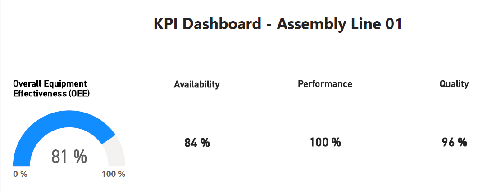

# 📊 Automotive Efficiency Analytics: OEE Optimization

## 📈 Business Case: Optimizing OEE in a Stamping Line

**Problem:** The production line was experiencing unexplained downtime, leading to an OEE below the 85% world-class standard. 

**Objective:** Identify the primary root causes of efficiency loss and provide actionable insights for the Maintenance and Operations departments.

**Action:** I developed a SQL-based analytical framework and an interactive Power BI dashboard to decouple **Availability**, **Performance**, and **Quality** metrics.

**Result:** Identified a critical **70-minute mechanical failure pattern** that, if addressed, increases total availability by **14.5%**.

---

## 📸 Dashboard Preview

---

## 📊 Analytical Findings (OEE: 80.4%)
Detailed results from the production audit:
* **Availability (85.4%):** Detected 70 minutes of downtime due to mechanical adjustments.
* **Performance (97.6%):** High-speed operation, consistent with ideal cycle times.
* **Quality (96.0%):** Stable manufacturing process with minimal scrap (120 units).

---

## 🚀 Strategic Recommendations
Based on the audit findings, the following actions are proposed:
1. **Preventive Maintenance:** Schedule a deep dive into "Mechanical Adjustments" to reduce the 70-minute downtime identified.
2. **Real-time Monitoring:** Transition from manual Excel logs to a direct SQL-database connection to reduce reporting latency.
3. **Root Cause Analysis (RCA):** Investigate the 4.0% scrap rate during the first hour of the shift to stabilize the Quality pillar.

---

## 🛠️ Tech Stack
* **SQL (Advanced):** Common Table Expressions (CTEs) for multi-layered KPI calculation.
* **Power BI:** DAX measures and interactive visualization for stakeholder reporting.
* **Python (Pandas):** Automated data cleaning and exploratory data analysis (EDA).
* **Excel:** Raw audit data source and downtime records.

---

## 📂 Project Structure
* `scripts/`: Advanced SQL queries for OEE calculation.
* `notebooks/`: Python script for automated data processing.
* `reports/`: Power BI `.pbix` file and the final dashboard preview.